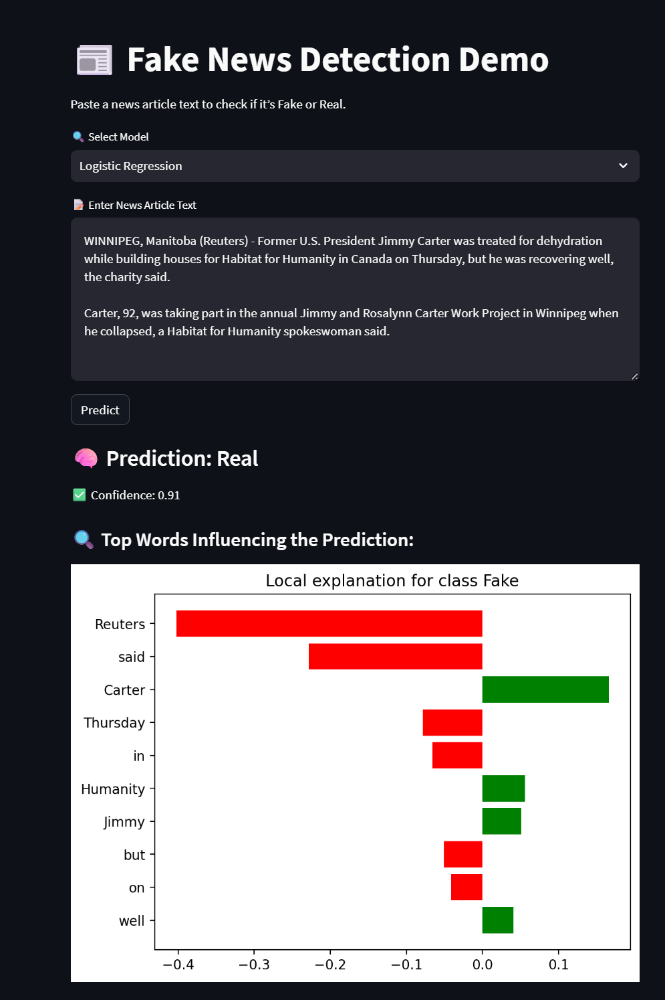

# 📰 Fake News Detection using NLP and ML

This project builds a **Fake News Detection** web application using **Natural Language Processing (NLP)** and **Machine Learning**, based on the [WELFake Dataset](https://zenodo.org/record/4561253). The app is built with **Streamlit** and includes model explainability with **LIME**.

---

## 📁 Dataset

- Source: [WELFake Dataset - Zenodo](https://zenodo.org/record/4561253)
- File: `WELFake_Dataset.csv`
- Contains ~72,000 news articles labeled as `real` or `fake`.

---

## 🧠 Models Trained

- Logistic Regression ✅
- Random Forest ✅
- Naive Bayes ✅
- SVM (with `SVC(probability=True)`) ✅

Each model is saved in the `models/` directory along with the TF-IDF vectorizer.

---

## 📂 Folder Structure

```
Fake-News-Detection-NLP/
│
├── data/
│   └── WELFake_Dataset.csv
│
├── models/
│   ├── logistic_regression_model.pkl
│   ├── random_forest_model.pkl
│   ├── naive_bayes_model.pkl
│   ├── svm_model.pkl
│   └── tfidf_vectorizer.pkl
│
├── src/
│   ├── data_preprocessing.py
│   ├── model_training.py
│   └── explainableai.py
│
├── web_app/
│   └── streamlit_app.py
│
├── requirements.txt
└── README.md
```

---

## 🚀 Running the App

1. **Install dependencies**

```bash
pip install -r requirements.txt
```

2. **Train the models** (if not already trained)

```bash
python -m src.model_training
```

3. **Run the Streamlit app**

```bash
streamlit run web_app/streamlit_app.py
```

---

## 🌐 App Features

- Enter or paste any news article text
- Choose the ML model to use for prediction
- Shows prediction: **Fake** or **Real**
- Displays prediction **confidence**
- Explains model output using **LIME**

---

## 🛠 Dependencies

- `scikit-learn`
- `pandas`, `numpy`
- `streamlit`
- `joblib`
- `lime`

Install with:

```bash
pip install -r requirements.txt
```

---

## 📊 Model Performance Summary

| Model                | Accuracy | Precision | Recall | F1-Score |
|----------------------|----------|-----------|--------|----------|
| **SVM**              | 0.9513   | 0.9471    | 0.9582 | 0.9526   |
| **Logistic Regression** | 0.9440   | 0.9410    | 0.9501 | 0.9455   |
| **Random Forest**    | 0.9435   | 0.9233    | 0.9701 | 0.9461   |
| **Naive Bayes**      | 0.8429   | 0.8294    | 0.8720 | 0.8501   |


---

## 📌 Notes

- SVMs with `LinearSVC` do **not support probability** by default. Use `SVC(probability=True)`.
- Training SVM on full dataset may take longer time. Logistic Regression gives high accuracy with less time.

---

## ✨ Acknowledgments

- [WELFake Dataset (Zenodo)](https://zenodo.org/record/4561253)
- [Scikit-learn](https://scikit-learn.org/)
- [Streamlit](https://streamlit.io/)

  
